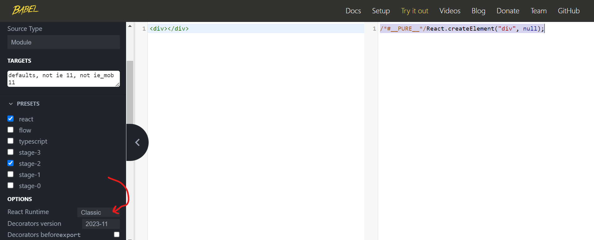

# React Notes

## What is React?

It is a UI library

## What is Vite?

It is a build tool 

## Steps

1. generate a project using npm

```
npm create vite@latest
```

options:
- Project name: hello-react
- Framework: React
- variant: JavaScript

2. follow the instructions to start up the application

```
cd hello-react
npm install
npm run dev
```

Note: warnings when running npm install

(npm is like maven's ability to manage and install dependencies)

## Notes

How can we write code easier but still have it understood by the browser? 
TRANSPILING! converts it back into syntax understood by the browser

Examples: 
 - babel.com try it out with `<div></div> ` changes it into:
 

Build process:

- transpiler (babel)
- minification (want files to load fast - smaller files size by removing whitespace shorting variable names)
- bundling all our js files in to one file 

Make sure to put contents of /dist on your static websit hosting option (AWS)

Note: Why use a virtual dom like ReactDOM instead of interact with the DOM?

1. performance 
2. simplicity - api that makes it easier to code interactions with the dom
3. Rendering optimization
   - because it has diffing algorithms - find the minimum set of changes needed to be rerendered in the dom
   - instead of letting the DOM do frequent reflows and repaints runs some logic to prevent frequent reflows and improves performance
4. Easier integeration with State Managment

